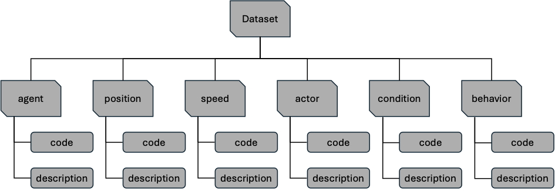
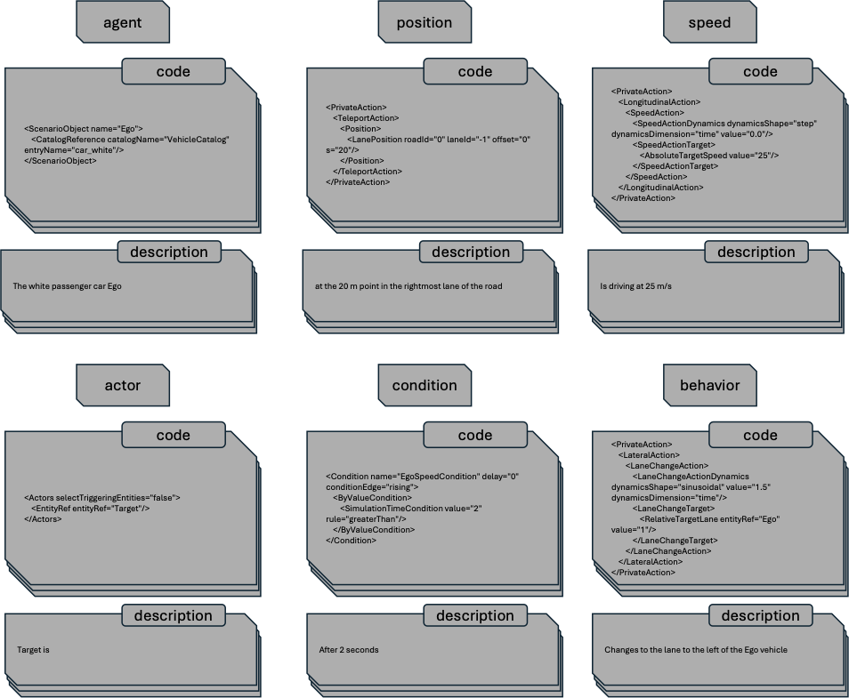

# OpenSCENARIO Scenario-Fragment Dataset

## Overview

This repository provides a publicly available dataset of OpenSCENARIO code fragments designed to support **reusable and composable autonomous driving scenario generation**.

Unlike conventional scenario datasets that provide complete, monolithic `.xosc` files, this dataset decomposes each driving scenario into fine-grained **semantic code fragments**. Each fragment is stored as a **code–description pair**: a syntactically valid OpenSCENARIO XML snippet paired with its aligned natural-language description.

This representation enables:
- **Semantic retrieval** of individual scenario components
- **Flexible reuse and recombination** of fragments across scenarios
- **LLM-based and data-driven** scenario generation research

---

## Dataset Structure

Each source scenario is decomposed into six functional domains that together capture the essential constituents of a driving situation.

| Domain | OpenSCENARIO Element | Description |
|---|---|---|
| **agent** | `ScenarioObject` | Definition of a traffic participant (vehicle/pedestrian type, catalog reference) |
| **position** | `PrivateAction` (position) | Spatial initialization or placement of an entity |
| **speed** | `PrivateAction` (speed) | Longitudinal speed initialization or update |
| **actor** | `Actors` | Set of entities involved in a maneuver |
| **condition** | `Condition` | Triggering logic for scenario events |
| **behavior** | `PrivateAction` (maneuver) | Executable maneuver action (e.g., lane change, acceleration) |

### Code–Description Pair Examples

Each record in the dataset follows a consistent code–description pair format as illustrated below.

---

## Dataset Statistics

The dataset was constructed from **481 source scenarios** collected from 6 publicly available repositories.

### Source Scenarios

| Source | Scenarios |
|---|---|
| [ontology scenario](https://github.com/stefaniguneshka/ontology-scenario) | 31 |
| [carla scenario runner](https://github.com/carla-simulator/scenario_runner) | 16 |
| [esmini](https://github.com/esmini/esmini) | 60 |
| [sl-3-1-osc-alks-scenarios](https://github.com/openMSL/sl-3-1-osc-alks-scenarios) | 15 |
| [OSC-NCAP-scenarios](https://github.com/vectorgrp/OSC-NCAP-scenarios) | 13 |
| [ConScenD](https://arxiv.org/abs/2103.09772) | 346 |
| **Total** | **481** |

### Fragment Distribution

A total of **1,112 code–description pairs** were extracted across the six functional domains.

| Domain | OSC Element | Pairs | Ratio (%) |
|---|---|---|---|
| agent | `ScenarioObject` | 384 | 34.5 |
| position | `PrivateAction` (position) | 183 | 16.5 |
| speed | `PrivateAction` (speed) | 65 | 5.8 |
| actor | `Actors` | 50 | 4.5 |
| condition | `Condition` | 264 | 23.7 |
| behavior | `PrivateAction` (maneuver) | 166 | 15.0 |
| **Total** | – | **1,112** | **100.0** |

